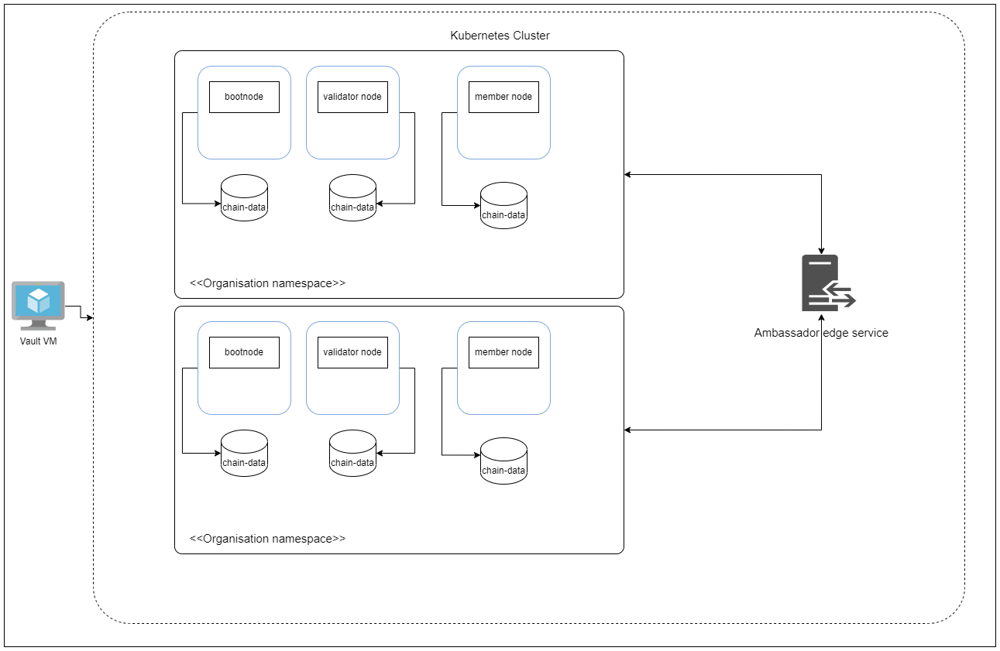

[//]: # (##############################################################################################)
[//]: # (Copyright Accenture. All Rights Reserved.)
[//]: # (SPDX-License-Identifier: Apache-2.0)
[//]: # (##############################################################################################)

# Substrate Architecture Reference

## Kubernetes

### Nodes with Ambassador proxy

The following diagram shows how substrate boot, member and validator nodes be deployed on your Kubernetes instance.

**Notes:**

1. Pods are shown in blue in the diagram.

1. Each peer pod will have five init-containers: `node-secrets` to get node-key, aura and grandpa secret seeds from Vault, `retrieve-chainspec` to retrieve the genesis file from Vault, `download-chain-spec` to download the chain spec if customChainspecUrl is defined and `query-services` to query the chain services.

1. Each peer pod will then have one containers: `{{ .Values.node.chain }}` this being the name of the chain definied in the chart. This container is the substrate node.

1. The storage uses a Kubernetes Persistent Volume.

### Nodes with Kubernetes internal networking

The following diagram shows how substrate boot, member and validator nodes be deployed on your Kubernetes instance.

**Notes:**

1. Pods are shown in blue in the diagram.

1. Each peer pod will have five init-containers: `node-secrets` to get node-key, aura and grandpa secret seeds from Vault, `retrieve-chainspec` to retrieve the genesis file from Vault, `download-chain-spec` to download the chain spec if customChainspecUrl is defined and `query-services` to query the chain services.

1. Each peer pod will then have one containers: `{{ .Values.node.chain }}` this being the name of the chain definied in the chart. This container is the substrate node.

1. The storage uses a Kubernetes Persistent Volume.