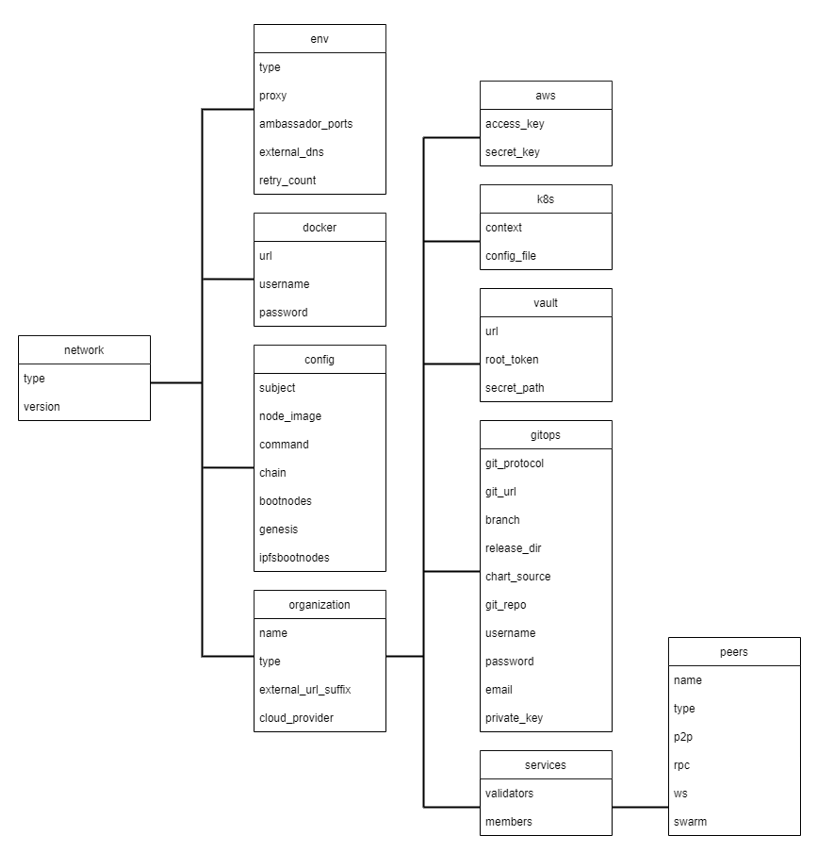
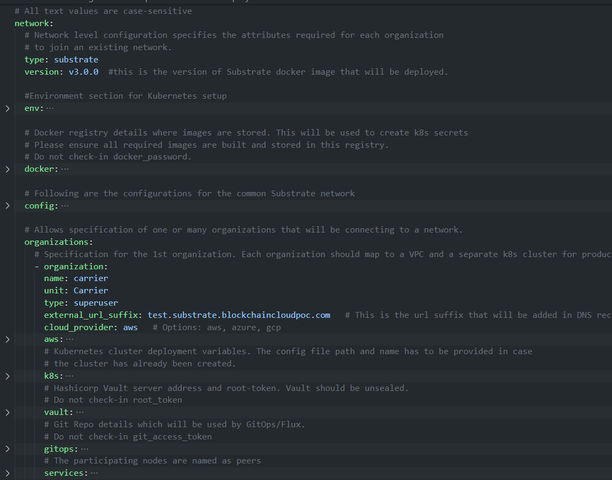

[//]: # (##############################################################################################)
[//]: # (Copyright Accenture. All Rights Reserved.)
[//]: # (SPDX-License-Identifier: Apache-2.0)
[//]: # (##############################################################################################)

# Configuration file specification: Substrate
A network.yaml file is the base configuration file designed in Hyperledger Bevel for setting up a Substrate DLT network. This file contains all the configurations related to the network that has to be deployed. Below shows its structure.


Before setting up a Substrate DLT/Blockchain network, this file needs to be updated with the required specifications.  

A sample configuration file is provided in the repo path:  
`platforms/substrate/configuration/samples/network-substrate.yaml` 

A json-schema definition is provided in `platforms/network-schema.json` to assist with semantic validations and lints. You can use your favorite yaml lint plugin compatible with json-schema specification, like `redhat.vscode-yaml` for VSCode. You need to adjust the directive in template located in the first line based on your actual build directory:

`# yaml-language-server: $schema=../platforms/network-schema.json`

The configurations are grouped in the following sections for better understanding.

* type

* version

* env

* docker

* config

* organizations

Here is the snapshot from the sample configuration file



The sections in the sample configuration file are  

`type` defines the platform choice like corda/fabric/indy/substrate, here in the example its **substrate**.

`version` defines the version of platform being used. The current substrate version support is for **latest**

---

`env` section contains the environment type and additional (other than 8443) Ambassador port configuration. Value for proxy field under this section can only be Ambassador as haproxy has not been implemented for substrate.

The snapshot of the `env` section with example value is below
```yaml 
  env:
    type: "substratedev"              # tag for the environment. Important to run multiple flux on single cluster
    proxy: ambassador               # value has to be 'ambassador' as 'haproxy' has not been implemented for Substrate
    #  These ports are enabled per cluster, so if you have multiple clusters you do not need so many ports
    #  This sample uses a single cluster, so we have to open 4 ports for each Node. These ports are again specified for each organization below
    ambassadorPorts:                # Any additional Ambassador ports can be given here, this is valid only if proxy='ambassador'
      portRange:              # For a range of ports 
        from: 15010 
        to: 15043
    # ports: 15020,15021      # For specific ports    
    retry_count: 20                 # Retry count for the checks on Kubernetes cluster
    external_dns: enabled           # Should be enabled if using external-dns for automatic route configuration
```
The fields under `env` section are 

| Field      | Description                                 |
|------------|---------------------------------------------|
| type       | Environment type. Can be like dev/test/prod.|
| proxy      | Choice of the Cluster Ingress controller. Currently supports 'ambassador' only as 'haproxy' has not been implemented for Substrate |
| ambassadorPorts   | Any additional Ambassador ports can be given here. This is only valid if `proxy: ambassador`. These ports are enabled per cluster, so if you have multiple clusters you do not need so many ports to be opened on Ambassador. Our sample uses a single cluster, so we have to open 4 ports for each Node. These ports are again specified in the `organization` section.     |
| retry_count       | Retry count for the checks. Use a high number if your cluster is slow. |
|external_dns       | If the cluster has the external DNS service, this has to be set `enabled` so that the hosted zone is automatically updated. |

`docker` section contains the credentials of the repository where all the required images are built and stored.

The snapshot of the `docker` section with example values is below
```yaml
  # Docker registry details where images are stored. This will be used to create k8s secrets
  # Please ensure all required images are built and stored in this registry. 
  # Do not check-in docker_password.
  docker:
    url: "docker.io"
    username: "docker_username"
    password: "docker_password"
  
```
The fields under `docker` section are

| Field    | Description                            |
|----------|----------------------------------------|
| url      | Docker registry url                    |
| username | Username required for login to docker registry|
| password | Password required for login to docker registry|


`config` section contains the common configurations for the Substrate network.

The snapshot of the `config` section with example values is below
```yaml
  config:
    ## Certificate subject for the root CA of the network. 
    #  This is for development usage only where we create self-signed certificates and the truststores are generated automatically.
    #  Production systems should generate proper certificates and configure truststores accordingly.
    subject: "CN=DLT Root CA,OU=DLT,O=DLT,L=London,C=GB"
    # Provide the docker image which will be used for the Substrate Nodes in this network. (will be downloaded from docker.url)
    node_image: "paritytech/substrate-playground-template-node-template"
    # Provide the command which is used to start the node
    command: "substrate"     # Please ensure the command corresponds to the node_image above, for eg, target/debug/node-template    
    # provide a chain name for Substrate nodes
    chain: "substrate-gcp"
    # NOTE for the below paths, the directories should exist
    bootnodes: "/BUILD_DIR/substrate_bootnodes" # Location where bootnodes information is read or saved if empty
    genesis: "/BUILD_DIR/substrate_genesis"   # Location where information is read or saved if empty
```
The fields under `config` are

| Field       | Description                                              |
|-------------|----------------------------------------------------------|
| subject     | This is the subject of the root CA which will be created for the Substrate network. The root CA is for development purposes only, production networks should already have the root certificates.   |
| node_image | This is image name in which will be pulled from the specified docker registry. |
| command | This is the command which will run on the substrate node once it is alive.|
| chain | This is the name of the chain which is used for the substrate nodes and genesis.|
| bootnodes | Location where bootnode information is read or stored if empty, this is for bootnodes specified in the organization section of the configuration file. |
| genesis | This is the path where genesis.json will be stored for a new network.|


The `organizations` section contains the specifications of each organization.  

In the sample configuration example, we have four organization under the `organizations` section.

The snapshot of an organization field with sample values is below
```yaml
  organizations:
    # Specification for the 1st organization. Each organization should map to a VPC and a separate k8s cluster for production deployments
    - organization:
      name: carrier
      type: superuser
      external_url_suffix: subs.inteli-poc.com   # This is the url suffix that will be added in DNS recordset. Must be different for different clusters
      cloud_provider: gcp   # Options: aws, azure, gcp
```
Each `organization` under the `organizations` section has the following fields. 

| Field                                    | Description                                 |
|------------------------------------------|-----------------------------------------------------|
| name                                        | Name of the organization     |
| type                                        | Specifies the organization as the superuser/owner.    |
| external_url_suffix                         | Public url suffix of the cluster.         |
| cloud_provider                              | Cloud provider of the Kubernetes cluster for this organization. This field can be aws, azure, gcp or minikube |
| aws                                         | When the organization cluster is on AWS |
| k8s                                         | Kubernetes cluster deployment variables.|
| vault                                       | Contains Hashicorp Vault server address and root-token in the example |
| gitops                                      | Git Repo details which will be used by GitOps/Flux. |
| services                                    | Contains list of services which could ca/peer/orderers/concensus based on the type of organization |

For the `aws`, `k8s` and `vault` field the snapshot with sample values is below
```yaml
      aws:
        access_key: "aws_access_key"        # AWS Access key, only used when cloud_provider=aws
        secret_key: "aws_secret_key"        # AWS Secret key, only used when cloud_provider=aws
      # Kubernetes cluster deployment variables. The config file path and name has to be provided in case
      # the cluster has already been created.
      k8s:
        context: "GKE_CONTEXT"
        config_file: "/BUILD_DIR/config"
      # Hashicorp Vault server address and root-token. Vault should be unsealed.
      # Do not check-in root_token
      vault:
        url: "http://VAULT_URL:VAULT_PORT"
        root_token: "VAULT_TOKEN"
        secret_path: "secretsv2"
```

The `aws` field under each organization contains: (This will be ignored if cloud_provider is not `aws`)

| Field       | Description                                              |
|-------------|----------------------------------------------------------|
| access_key                              | AWS Access key  |
| secret_key                              | AWS Secret key  |

The `k8s` field under each organization contains

| Field       | Description                                              |
|-------------|----------------------------------------------------------|
| context                                 | Context/Name of the cluster where the organization entities should be deployed  |
| config_file                             | Path to the kubernetes cluster configuration file  |

The `vault` field under each organization contains

| Field       | Description                                              |
|-------------|----------------------------------------------------------|
| url                                 | url of the vault server including port  |
| root_token                             | root token of the vault server required to access the contents of the vault    |
| secret_path                             | the path in which secrets are stored, used to store and retrieve secrets from the vault   |

For gitops fields the snapshot from the sample configuration file with the example values is below
```yaml
      # Git Repo details which will be used by GitOps/Flux.
      # Do not check-in git_access_token
      gitops:
        git_protocol: "https" # Option for git over https or ssh
        git_url: "https://github.com/inteli-poc/bevel.git"         # Gitops https or ssh url for flux value files 
        branch: "substrate"           # Git branch where release is being made
        release_dir: "platforms/substrate/releases/dev" # Relative Path in the Git repo for flux sync per environment. 
        chart_source: "platforms/substrate/charts"     # Relative Path where the Helm charts are stored in Git repo
        git_repo: "github.com/inteli-poc/bevel.git"   # Gitops git repository URL for git push 
        username: "bevel"          # Git Service user who has rights to check-in in all branches
        password: "GIT_TOKEN"          # Git Server user password/token (Optional for ssh; Required for https)
        email: "bevel@inteli-poc.com"                # Email to use in git config
        private_key: "/BUILD_DIR/gitops"          # Path to private key file which has write-access to the git repo (Optional for https; Required for ssh)
```

The gitops field under each organization contains

| Field       | Description                                              |
|-------------|----------------------------------------------------------|
| git_protocol | Option for git over https or ssh. Can be `https` or `ssh` |
| git_url                              | SSH or HTTPs url of the repository where flux should be synced                                                            |
| branch                               | Branch of the repository where the Helm Charts and value files are stored                                        |
| release_dir                          | Relative path where flux should sync files                                                                       |
| chart_source                         | Relative path where the helm charts are stored                                                                   |
| git_repo                         | Gitops git repo URL https URL for git push like "github.com/hyperledger/bevel.git"             |
| username                             | Username which has access rights to read/write on repository                                                     |
| password                             | Password of the user which has access rights to read/write on repository (Optional for ssh; Required for https) |
| email                                | Email of the user to be used in git config                                                                       |
| private_key                          | Path to the private key file which has write-access to the git repo (Optional for https; Required for ssh) |

The services field for each organization under `organizations` section of Substrate contains list of `services`.

Each organization will have a services section which includes details of all the peers, all participating nodes are names as peers. The snapshot of peers service with example values is below
```yaml
        peers:
        - peer:
          name: carrier-bn
          subject: "O=Carrier,OU=Carrier,L=51.50/-0.13/London,C=GB" # This is the node subject. L=lat/long is mandatory for supplychain sample app
          type: bootnode         # value can be validator or bootnode ( or ipfs, for vitalAM)
          p2p:
            port: 30333
            ambassador: 15010       #Port exposed on ambassador service (use one port per org if using single cluster)
          rpc:
            port: 9933
          ws:
            port: 9944
        - peer:
          name: validator1
          subject: "O=Validator1,OU=Validator1,L=51.50/-0.13/London,C=GB" # This is the node subject. L=lat/long is mandatory for supplychain sample app
          type: validator         # value can be validator or bootnode ( or ipfs, for vitalAM)
          p2p:
            port: 30333
            ambassador: 15011       #Port exposed on ambassador service (use one port per org if using single cluster)
          rpc:
            port: 9933
          ws:
            port: 9944
```
The fields under `peer` are

| Field       | Description                                              |
|-------------|----------------------------------------------------------|
| name            | Name of the peer                |
| subject     | This is the alternative identity of the peer node    |
| type           | Type can be `bootnode`, `validator` and `member` |
| p2p.port   | P2P port |
| p2p.ambassador | The P2P Port when exposed on ambassador service|
| rpc.port   | RPC port |
| ws.port | WebSocket port |

